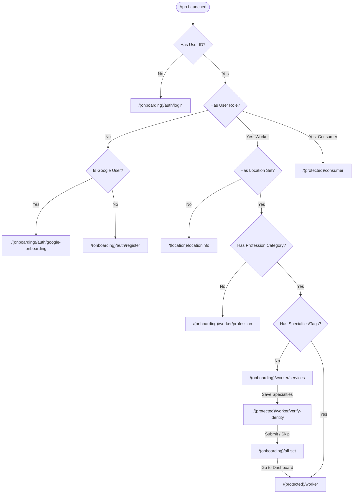
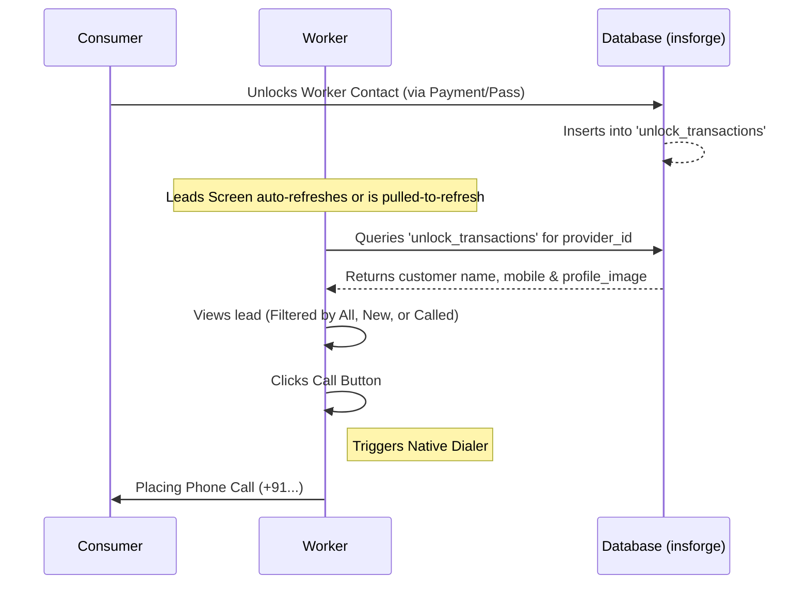
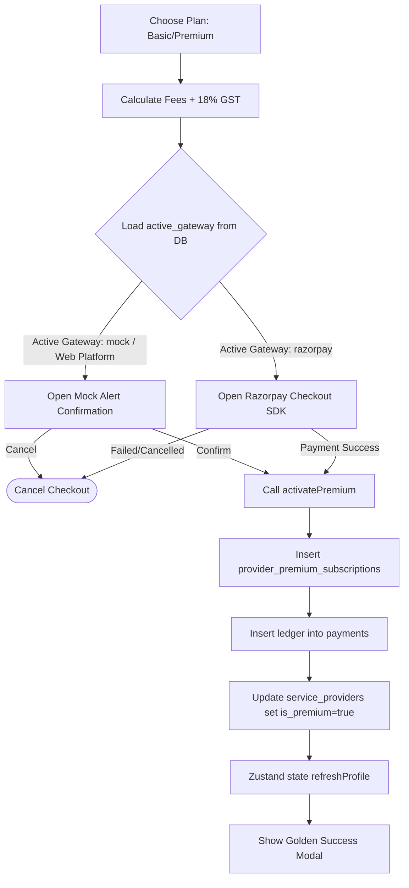

# Karmanisht Android Application — Worker (Service Provider) Flows

This document details the architecture, screen-by-screen routing rules, dashboard interactions, subscription management, and underlying database schemas that define the lifecycle of a **Worker (Service Provider)** in the Karmanisht Android App.

---

## 1. Onboarding & Routing Flow

When a user launches the application, the app evaluates their authentication state and profile completeness using the `getOnboardingRoute` utility to determine their destination.

### Onboarding Flow Architecture

### Detailed Screen Analysis

#### A. Location Setup (`/(location)/locationinfo`)
*   **Purpose**: Captures the worker's operational base and service coverage radius.
*   **Actions**:
    *   Workers input their neighborhood manually, select a रायपुर (Raipur) neighborhood suggestion (e.g., *Shankar Nagar, Telibandha*), or request GPS auto-detection.
    *   Workers adjust their service coverage radius via preset buttons (`2 km`, `5 km`, `10 km`, `20 km`, `30 km`).
    *   Workers can enable **"City-Wide" coverage** (automatically sets the search radius to `50 km`).
*   **Database Writes**: Writes coordinates, area label, and service radius to the `provider_locations` table.

#### B. Profession Selection (`/(onboarding)/worker/profession`)
*   **Purpose**: Selects the primary service category (e.g., Plumber, Electrician, Painter, etc.).
*   **Actions**:
    *   Displays a grid of active service categories fetched from `service_categories`.
    *   Saves the selected category to the worker's profile (column: `business_name` in the database).
*   **Database Writes**: Updates the `service_providers` record with the chosen category name and `professionId`.

#### C. Specialties Selection (`/(onboarding)/worker/services`)
*   **Purpose**: Filters the specific types of jobs the worker handles within their selected profession.
*   **Actions**:
    *   Queries `service_tags` filtered by the parent `category_id` (the profession chosen in the prior step).
    *   Displays sub-skills (e.g., *AC repair*, *Geyser installation* for an Electrician/HVAC provider) as pill tags.
    *   Calls the `updateWorkerSpecialties` action in the state store.
*   **Database Writes**: Performs a delete-then-insert transaction on `provider_services` to map the `provider_id` to chosen `category_id` and specific `tag_id`s.

#### D. Identity Verification / KYC (`/(protected)/worker/verify-identity`)
*   **Purpose**: Collects verified documents for trust and safety before profile activation.
*   **Actions**:
    *   Asks the worker to upload three photos: **Aadhaar Front**, **Aadhaar Back**, and **PAN Card (Front)**.
    *   Uses device camera or photo library to capture images, and uploads them to the InsForge storage bucket.
    *   Workers have the option to **"Skip, I'll do this later"** to preview the dashboard without immediate verification.
*   **Database Writes**: Updates `service_providers` table with document URLs (`aadhaar_front_url`, `aadhaar_back_url`, `pan_front_url`) and resets verification flags (`is_kyc_verified: false`, `is_verified: false`) to await admin review.

#### E. All-Set Screen (`/(onboarding)/all-set`)
*   **Purpose**: Displays a completion state with haptic feedback, verifying their online status and default service hours, before redirecting to the worker dashboard.

---

## 2. Worker Dashboard & Protected Layout

Once onboarded, workers navigate through a bottom tab bar layout containing three main pages defined in `src/app/(protected)/worker/_layout.tsx`:

1.  **Home (`index.tsx`)**: The primary dashboard showing profile details, online toggles, stats, reviews, and setup guides.
2.  **Leads (`leads.tsx`)**: Lead generation list where workers view and contact interested customers.
3.  **Settings (`settings.tsx`)**: Configuration options, translations, and profile modifications.

### Core Features on the Dashboard (`index.tsx`)

*   **Online/Offline Toggle**: A toggle switch that updates the worker's status instantly.
    > [NOTE]
    > Changing this switch calls `setOnline()` in the auth slice, updating the `is_active` boolean column in both the `users` and `service_providers` tables. This directly controls whether the worker appears on customer searches.
*   **Worker Statistics Card**: Shows live calculations for:
    *   **Rating**: Average customer rating (derived from reviews).
    *   **Jobs Done**: Total completed assignments (fetched from database).
    *   **Experience**: Worker's years in the industry.
*   **KYC / Verification Nudge**: If document verification is incomplete or pending, a warning card prompts the worker to visit the verification page.
*   **Recent Reviews Feed**: Displays ratings and comments left by consumers, showing reviewer name, rating stars, and date.

---

## 3. Leads & Communication Flow

Leads are generated when a consumer pays or uses a service pass to unlock a provider's phone number.

*   **Leads Query**: Queries the `unlock_transactions` table filtering by the authenticated `provider_id`. The query joins with the `users` table to display customer details.
*   **Filters**:
    *   **All**: The complete list of unlocked contacts.
    *   **New**: Contacts unlocked within the last 24 hours that the worker has not called yet.
    *   **Called**: Unlocked contacts the worker has already initiated a phone dial for.
*   **Communication**: The worker touches the phone icon, which executes `Linking.openURL('tel:<phone_number>')` to launch the device's native telephone dialer.

---

## 4. Subscription & Premium Activation Flow

Karmanisht offers a subscription tier for workers to gain extra visibility.

### Plans & Benefits
1.  **Basic Plan** (default/low-tier): Standard search results, profile visible within Raipur, and up to 50 customer leads per month.
2.  **Premium Plan**: Top ranking in searches, a golden premium badge on the profile, 3× profile visibility boost, and unlimited customer leads.

### Payment & Activation Sequence

### Database Updates during `activatePremium()`

When a payment succeeds, the application executes a series of queries:

| Step | Database Table | Actions & Columns Written |
| :--- | :--- | :--- |
| **1** | `provider_premium_subscriptions` | Inserts `provider_id`, `profession_id`, `city_id`, `amount_paid` (with GST), `expires_at` (exactly 1 year in future), and `is_active: true`. |
| **2** | `payments` | Writes ledger entry: `user_id`, `payment_type: 'premium_subscription'`, `reference_id` (matching subscription UUID), `amount` (total paid), `gateway`, `gateway_payment_id`, and `payment_status: 'paid'`. |
| **3** | `service_providers` | Updates `is_premium` to `true` (an automated PostgreSQL trigger `update_provider_premium_status` is configured on the backend to keep this in sync). |
| **4** | Zustand State Store | Calls `refreshProfile()` to sync local cache immediately, enabling immediate UI changes (Premium badge, search boosts). |

---

## 5. Database Schema Reference

The tables and key fields that support the worker module are detailed below.

### Primary Worker Profile Tables

#### `service_providers`
Stores primary profile details for workers.
*   `id` (UUID, Primary Key)
*   `full_name` (Text)
*   `mobile` (Text)
*   `business_name` (Text) — *Saves the profession name*
*   `bio` (Text)
*   `experience_years` (Integer)
*   `is_active` (Boolean) — *Controls online/offline search availability*
*   `is_premium` (Boolean) — *Premium subscription status*
*   `average_rating` (Numeric)
*   `total_jobs_completed` (Integer)
*   `aadhaar_front_url` / `aadhaar_back_url` / `pan_front_url` (Text) — *KYC Document links*
*   `is_kyc_verified` (Boolean)
*   `is_verified` (Boolean)

#### `provider_locations`
Maintains GPS coordinates and radius for local lookups.
*   `id` (UUID, Primary Key)
*   `provider_id` (UUID, Foreign Key to `service_providers`)
*   `area_name` (Text)
*   `service_radius_km` (Integer) — *e.g., 2, 5, 10, 20, 30, or 50*
*   `latitude` (Numeric)
*   `longitude` (Numeric)

#### `provider_services`
Maps workers to categories and service tags.
*   `provider_id` (UUID, Foreign Key to `service_providers`)
*   `category_id` (UUID, Foreign Key to `service_categories`)
*   `tag_id` (UUID, Foreign Key to `service_tags`, Nullable)

---

### Supporting & Transactional Tables

#### `service_categories`
*   `id` (UUID, Primary Key)
*   `name` (Text) — *e.g. Electrician, Painter*
*   `icon` (Text)
*   `color` (Text)
*   `is_active` (Boolean)

#### `service_tags`
*   `id` (UUID, Primary Key)
*   `category_id` (UUID, Foreign Key to `service_categories`)
*   `name` (Text) — *e.g. Fan Repair, Wall Painting*

#### `unlock_transactions`
*   `id` (UUID, Primary Key)
*   `user_id` (UUID, Foreign Key to `users`) — *The consumer*
*   `provider_id` (UUID, Foreign Key to `service_providers`) — *The worker*
*   `amount` (Numeric)
*   `payment_status` (Text)
*   `unlocked_at` (Timestamp)

#### `provider_premium_subscriptions`
*   `id` (UUID, Primary Key)
*   `provider_id` (UUID, Foreign Key to `service_providers`)
*   `profession_id` (UUID, Foreign Key to `service_categories`)
*   `city_id` (UUID, Foreign Key to `cities`)
*   `amount_paid` (Numeric)
*   `expires_at` (Timestamp)
*   `is_active` (Boolean)

#### `payments`
*   `id` (UUID, Primary Key)
*   `user_id` (UUID, Foreign Key to `users`)
*   `payment_type` (Text) — *'premium_subscription'*
*   `reference_id` (UUID) — *References subscription ID*
*   `amount` (Numeric)
*   `gateway` (Text) — *'razorpay', 'stripe', etc.*
*   `gateway_payment_id` (Text)
*   `payment_status` (Text) — *'paid'*
